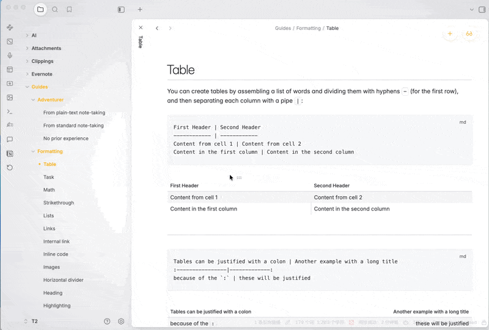

# Auto Toggle Mode Plugin for Obsidian
This plugin provides intelligent mode switching functionality:

## Features

1. When you're in reading mode and click on the note content, it switches to editing mode **immediately**
2. When you leave the document or minimize the window, after a configurable time it switches back to reading mode
3. **Smart control detection**: When you click on Obsidian's mode toggle controls (toolbar buttons, status bar items), it allows manual switching without interference
4. **Debounced clicks**: Prevents accidental double-clicks from causing mode switching issues

## Installation

1. Download the latest release of the plugin
2. Extract the files to your Obsidian vault's plugins folder:
   - `<your-vault>/.obsidian/plugins/auto-toggle-mode/`
3. In Obsidian, go to Settings > Community Plugins
4. Enable the "Auto Toggle Mode" plugin

## Usage

1. Open any note in Obsidian
2. Ensure you're in reading mode (preview mode)
3. Click anywhere on the note content to switch to editing mode **immediately**
4. When you minimize the window or switch to another tab, after the configured time it will automatically switch back to reading mode
5. While in editing mode:
   - Click on Obsidian's mode toggle controls (toolbar buttons) to switch back to reading mode
   - Click on note content to stay in editing mode
   - Use Obsidian's built-in controls to switch modes manually

## Configuration

The plugin includes a settings tab where you can customize:

- **Timeout duration**: Set the time (in seconds) before the plugin automatically switches back to reading mode after window is minimized. The default is 10 seconds, and you can set it anywhere between 1 and 60 seconds.

To access the settings:
1. In Obsidian, go to Settings > Community Plugins
2. Find "Auto Toggle Mode" in the list of plugins
3. Click the gear icon next to the plugin name
4. Adjust the timeout duration using the slider

## How It Works

This implementation provides intelligent mode switching:

1. **Content Click-to-Edit**: When you click on note content in reading mode, it immediately switches to editing mode.

2. **Control Detection**: When you click on Obsidian's built-in mode toggle controls (toolbar buttons, status bar items), the plugin detects this and allows the normal Obsidian behavior to occur without interference.

3. **Automatic Switch Back**: When you minimize the window or switch to another tab while in editing mode, it waits for the configured time and then automatically switches back to reading mode.

4. **Timer Cancellation**: If you return to the window before the time is up, the timer is cancelled and it stays in editing mode.

5. **Debouncing**: Clicks are debounced with a 300ms delay to prevent accidental double-clicks from causing mode switching issues.

## Development

1. Clone this repository
2. Run `npm install` to install dependencies
3. Run `npm run build` to compile the plugin
4. The compiled plugin will be in the `main.js` file

## Support

If you encounter any issues or have feature requests, please open an issue on the GitHub repository.
